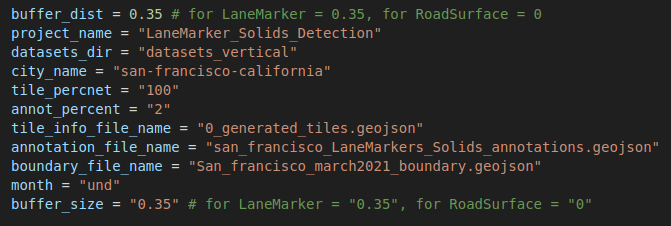

# SD Mapping preproccessing_s3 Module
The preprocessing_s3 code is an stand alone code to perform mask making for RoadSurface/LaneMarker_solids (either on local machine or on Ec2) while **data is located on s3 bucket** and masks will be witten on s3 bucket.


## Environment
The environemt is the main environment for SD_mapping
```bash
  conda activate SD_mapping_env
```
## Usage : 
The main file to run is preprocessing_executer.py. 


### Input Configuration
Some configuration of inputs should be performed wihtin the preprocessing_executer.py for each city that we want to perform mask making for.
> List of required configurations are as follows:

# Perform Configuration
To generate mask for an specific city, perform the following configuration for that city

> **buffer_dist = 0.35** &nbsp;&nbsp;&nbsp;for LaneMarker = 0.35, for RoadSurface = 0 <br>
> **project_name = "LaneMarker_Solids_Detection"** &nbsp;&nbsp;&nbsp;name of the project it can be "LaneMarker_Solids_Detection" or RoadSurface_Detection" <br>
> **datasets_dir = "datasets_vertical"** &nbsp;&nbsp;&nbsp;folder of datasets <br>
> **city_name = "san-francisco-california"** &nbsp;&nbsp;&nbsp;name of the city <br>
> **tile_percnet = "100"** &nbsp;&nbsp;&nbsp; tile percentage <br>
> **annot_percent = "2"** &nbsp;&nbsp;&nbsp;annotation percentatge <br>
> **tile_info_file_name = "0_generated_tiles.geojson"** &nbsp;&nbsp;&nbsp;name of tile_information.geojson <br>
> **annotation_file_name = "san_francisco_LaneMarkers_Solids_annotations.geojson"** &nbsp;&nbsp;&nbsp; name of the annotation_file.geojson <br>
> **boundary_file_name = "San_francisco_march2021_boundary.geojson"** &nbsp;&nbsp;&nbsp;name of the boundary_file.geojson <br>
> **month = "und"** &nbsp;&nbsp;&nbsp;month <br>
> **buffer_size = "0.35"** &nbsp;&nbsp;&nbsp;for LaneMarker = "0.35", for RoadSurface = "0" <br>

The Following Image Shows an Example of Configuration Setting: <br>



# To tun the preprocessing locally
Running the preprocessing generates maskes to be used for training. 

```bash
# not to get credintial error first have aws configure sso set up and then run the following
    export AWS_PROFILE=PowerUserAccess-691506669376 

    python preprocessing_executer.py
```
